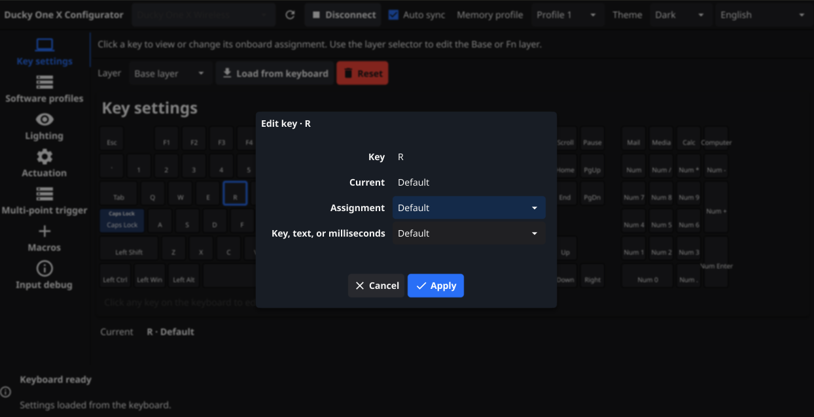
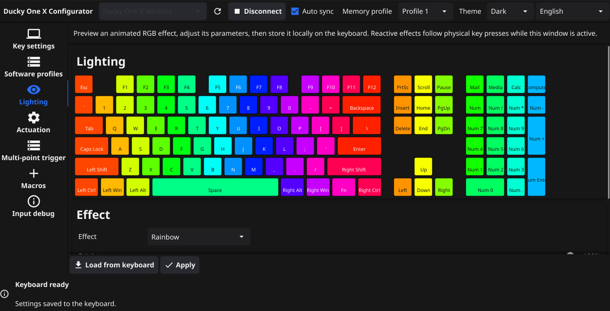
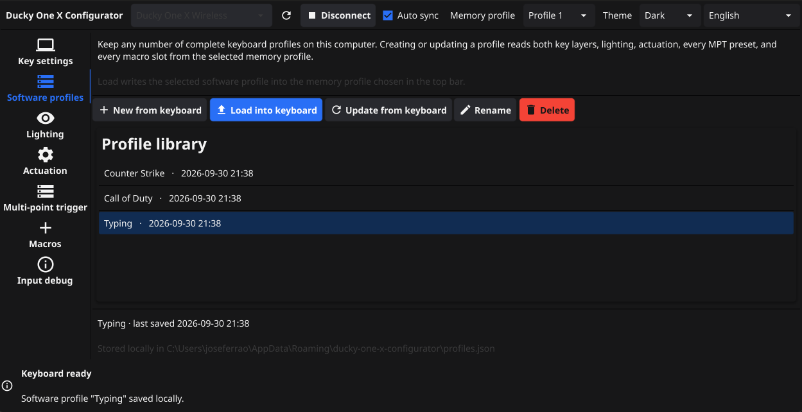

# Ducky One X Configurator

A native, offline desktop configurator for the Ducky One X keyboard.
It is written in Go with Fyne and communicates directly with the keyboard's vendor HID interface—no browser, account, or network connection is needed at runtime.

## Features

- Windows, Linux, and macOS desktop UI
- Automatic USB discovery, connection, firmware identification, and configuration loading
- Auto Sync enabled by default, with debounced live updates for lighting, actuation, MPT presets, and macros
- Switch between both onboard memory profiles and immediately load the selected profile
- Keep an unlimited library of named software profiles on disk and load any one into the selected onboard memory profile
- Visual full-size keyboard with click-to-edit Base and Fn key assignments
- Interactive lighting previews driven by physical key presses: single-key reactive pulses, press-centered ripple, three directional rainbow patterns, a full-key analog light bar, and per-key color painting
- Per-key actuation overlays, click feedback, and rapid-trigger settings across all 126 matrix positions
- Four-stage multi-point-trigger presets (MPT1–MPT14)
- Fourteen onboard macro slots with press, release, click, delay, and text actions
- System, light, and dark themes
- Live language switching with English, French, German, European Portuguese, and Simplified Chinese
- System-tray operation with close-to-tray behavior and an installer-managed start-at-login mode






## Installers

The installers register the application to start at desktop login with `--autostart`. Use **Settings → Launch automatically on startup** to enable or disable this for your user account. The app continues connecting to the keyboard in the background; use the tray icon to open it or quit it completely. Closing the main window hides it in the tray.

- **Windows:** run `./scripts/package-windows.ps1`. This creates `dist/Ducky-One-X-Configurator-Setup-<version>.exe` with Start menu and optional desktop shortcuts, a system-wide startup entry, and an uninstaller. Building requires Inno Setup 6.
- **Linux:** run `sh ./scripts/package-linux.sh`. This creates both a Debian package and a generic `.tar.gz` installer bundle. The packages install the desktop entry, system-wide XDG autostart entry, and Ducky HID udev rule.
- **macOS:** run `sh ./scripts/package-macos.sh` on a Mac. This creates a `.pkg` containing the application bundle and a system LaunchAgent. Set `MACOS_SIGN_IDENTITY` and `MACOS_INSTALLER_IDENTITY` when signed distribution is required.

A normal shortcut launch opens the window. `ducky-config --minimized` starts directly in the system tray.

Open **Settings** in the top bar or tray menu to choose the theme and language,
or change automatic startup. Settings are saved immediately. Automatic startup
opens the app in the tray at the next login; disabling it also suppresses existing
installer startup entries for your account. On a source build, enabling startup
registers the current executable, so use a permanent build rather than `go run`.

## Run from source

Install Go 1.24 or later and a C compiler, then run:

```sh
go run ./cmd/ducky-config
```

Fyne and the HID library both use CGo. Platform development prerequisites are:

- **Windows:** MSYS2/MinGW-w64 (recommended by Fyne), or Zig. With Zig in PowerShell:

  ```powershell
  $env:CGO_ENABLED = "1"
  $env:CC = "zig cc"
  go run ./cmd/ducky-config
  ```

- **macOS:** install the Xcode command-line tools with `xcode-select --install`.
- **Debian/Ubuntu:**

  ```sh
  sudo apt-get install golang gcc libgl1-mesa-dev xorg-dev libwayland-dev libxkbcommon-dev libudev-dev
  ```

On Linux, install the included udev rule so the logged-in desktop user can open the HID interface:

```sh
sudo install -m 0644 packaging/99-ducky-one-x.rules /etc/udev/rules.d/
sudo udevadm control --reload-rules
sudo udevadm trigger
```

Reconnect the keyboard after installing the rule.

## Build

The duck artwork in `assets/ducky.svg` is embedded in the GUI and tray. Generated
PNG, ICO, and ICNS files supply the application and installer icons. Windows
executable icon resources are checked in for amd64 and 386, so normal builds
do not require an icon generator. After changing the SVG, run
`go run ./scripts/generate-icons` to refresh the image files, then run
`./scripts/generate-icons.ps1` on Windows with MinGW-w64 `windres` available
to refresh the executable resources as well.

Build for the current operating system:

```sh
./scripts/build.sh
```

On Windows PowerShell:

```powershell
./scripts/build.ps1
```

The output is placed in `dist/`. Native builds are recommended because Fyne and HIDAPI require target-platform C toolchains when cross-compiling.

## Tests

The protocol and serialization tests do not need a keyboard:

```sh
go test ./internal/protocol ./internal/i18n
```

Run the full test/build check on a machine with the native GUI prerequisites:

```sh
go test ./...
```

## Safety and hardware scope

 - The application only enumerates HID interfaces with Ducky's vendor ID `0x3233` and configuration usage page `0x008c`.
 - Writes are serialized and responses are matched to the expected command. Settings still change persistent keyboard memory, so test new macro and analog settings before relying on them in critical workflows.
 - Software profiles are saved as `profiles.json` under the operating system's per-user configuration directory. Each entry contains both key layers, lighting, actuation, all MPT presets, and all macro slots.
 - See [docs/protocol.md](docs/protocol.md) for the implemented command map and [docs/architecture.md](docs/architecture.md) for the code layout.

 ## License
 - This is an independent project and is not affiliated with DuckyChannel International Co., Ltd.
 - Licensed under the MIT License. See [LICENSE](LICENSE) for details.
